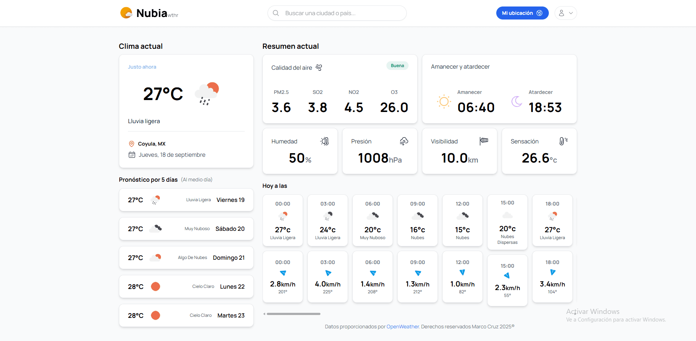
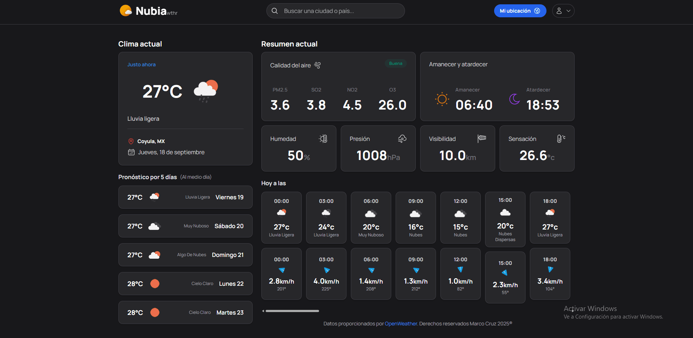

#  NubiaWeather

Aplicación web para consultar el clima actual y el pronóstico en cualquier ciudad del mundo en **tiempo real**.  
Construida con **HTML5, CSS3 (TailwindCSS) y JavaScript**, utilizando una API de clima para obtener datos actualizados de OpenWeather.com.

---

## 📸 Vista previa

---

## ✨ Características

- **Búsqueda de ciudades o países** en tiempo real.  
- Opción de usar **mi ubicación** para obtener el clima local.  
- Muestra clima actual y **pronóstico de 5 días**.  
- Soporte para **modo claro y oscuro**.  
- **Diseño responsive** (funciona en móviles, tablets y escritorio).  

---

## 🚀 Tecnologías utilizadas

- **HTML5**  
- **CSS3 / TailwindCSS**  
- **JavaScript (Vanilla)**  
- **API del Clima** (para obtener datos en tiempo real)  

---

## 🔑 Configuración de API

- **Regístrate en OpenWeather u otro servicio de clima.**  
- **Obtén tu API Ke**  
- **Colócala en el archivo public/dist/js/api.js**

---

